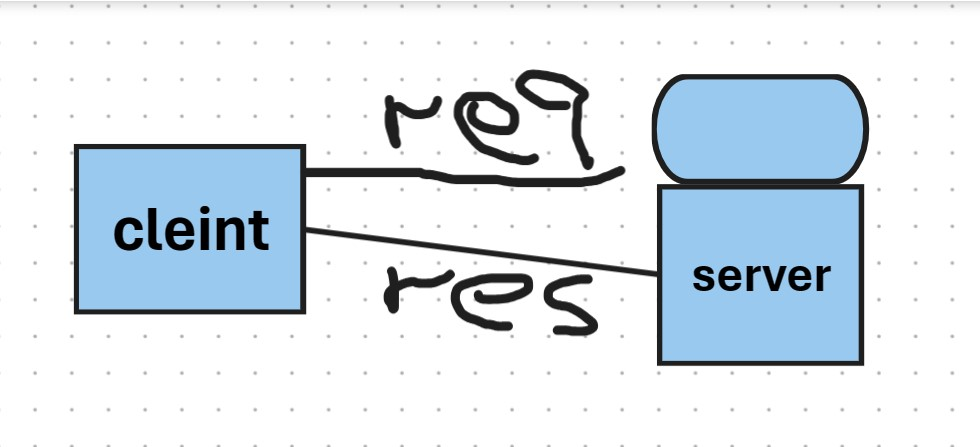

# Movies-Library
**Author Name**: [mustafa raed]

## WRRC

## Getting Started
1. Install Node.js and npm
2. Clone this repository to your local machine
3. Initialize your project  "npm init -y"
4. Install Express.js "npm install express cors"
## Project Features
1.  retrieves movie data from a JSON file 
2. When accessing the main route ("/"), the server responds with the movie data retrieved from the JSON file.
3. Accessing the "/favorite" route returns a simple message
4. Error Handling